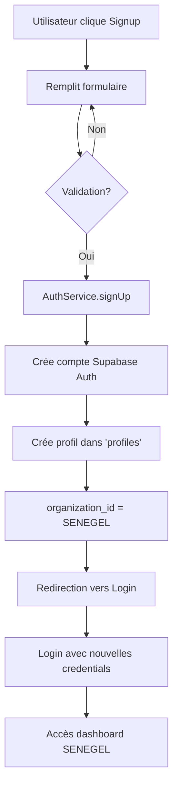
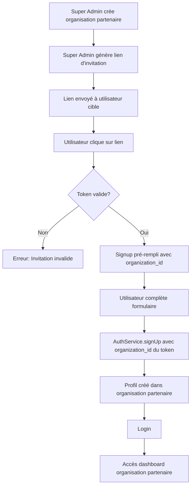

# 📝 Login & Signup - Architecture Multi-Tenant

## Vue d'ensemble

Les pages Login et Signup ont été mises à jour pour refléter l'architecture multi-tenant d'EcosystIA tout en maintenant SENEGEL comme organisation principale.

---

## 🎨 Changements Visuels

### Panel Gauche (Login & Signup)

**Avant** :
```
SENEGEL
Plateforme de Gestion et de Formation
```

**Après** :
```
EcosystIA
Propulsée par SENEGEL
Plateforme Multi-Organisations
```

### Icônes Informatives

**Avant** :
- ✅ Écosystème Unique
- ✅ Permissions Granulaires

**Après** :
- 🏢 Multi-Organisations
- 👥 Écosystème Unifié
- 🛡️ Sécurité & Isolation

---

## 📋 Page Signup - Modifications

### Bannière Informative

**Avant** :
```
Plateforme Unifiée SENEGEL
Choisissez votre rôle parmi nos 30+ rôles spécialisés...
```

**Après** :
```
🏢 Vous rejoignez SENEGEL

Vous créez un compte dans SENEGEL, l'organisation principale d'EcosystIA.
Choisissez votre rôle parmi nos 30+ rôles spécialisés.

🤝 Organisations partenaires : Les utilisateurs rejoignent sur invitation uniquement.
```

---

## 🔧 Logique Backend (authService.ts)

### Code Mis à Jour

```typescript
if (authData.user) {
  // ═══════════════════════════════════════════════════════════
  // LOGIQUE MULTI-TENANT
  // ═══════════════════════════════════════════════════════════
  // Les inscriptions publiques rejoignent SENEGEL (organisation principale)
  // Les organisations partenaires nécessitent une invitation
  // 
  // TODO FUTUR: Système d'invitation
  // - Détecter invitationToken dans URL params
  // - Si invitationToken présent → récupérer organization_id depuis le token
  // - Sinon → SENEGEL par défaut
  // ═══════════════════════════════════════════════════════════
  
  const organizationId = '550e8400-e29b-41d4-a716-446655440000';  // SENEGEL (défaut)
  
  // Créer le profil utilisateur
  const { error: profileError } = await supabase
    .from('profiles')
    .insert({
      user_id: authData.user.id,
      email: data.email,
      full_name: data.full_name,
      phone_number: data.phone_number,
      role: data.role || 'student',
      organization_id: organizationId  // Toujours SENEGEL pour signups publics
    });
}
```

---

## 🎯 Logique d'Inscription

### Flux Actuel



### Flux Futur avec Invitation



---

## 📊 Scénarios d'Utilisation

### Scénario 1 : Inscription Publique (Actuel)

**Qui** : Tout utilisateur public  
**Comment** : Via le bouton Signup  
**Résultat** : Compte créé dans SENEGEL  
**Accès** : Dashboard SENEGEL avec permissions selon rôle

### Scénario 2 : Super Admin Crée Organisation (Actuel)

**Qui** : Super Administrateur  
**Comment** : Via `OrganizationManagement`  
**Résultat** : Nouvelle organisation partenaire créée  
**Accès** : Super Admin gère l'organisation

### Scénario 3 : Invitation Utilisateur Partenaire (Futur)

**Qui** : Utilisateur invité par organisation partenaire  
**Comment** : Lien d'invitation unique  
**Résultat** : Compte créé dans organisation partenaire  
**Accès** : Dashboard organisation partenaire isolé

### Scénario 4 : Migration Utilisateur (Futur)

**Qui** : Super Administrateur  
**Comment** : Via interface "Migrer utilisateur"  
**Résultat** : `organization_id` changé dans `profiles`  
**Accès** : Utilisateur voit maintenant les données de la nouvelle organisation

---

## 🔮 Fonctionnalités Futures

### 1. Système d'Invitation

**Structure de données** :

```sql
CREATE TABLE invitation_tokens (
  id UUID PRIMARY KEY DEFAULT gen_random_uuid(),
  organization_id UUID REFERENCES organizations(id) NOT NULL,
  token TEXT UNIQUE NOT NULL,
  email TEXT,  -- Optionnel : limiter à un email spécifique
  role TEXT,   -- Optionnel : pré-définir le rôle
  max_uses INTEGER DEFAULT 1,
  used_count INTEGER DEFAULT 0,
  expires_at TIMESTAMPTZ NOT NULL,
  created_by UUID REFERENCES auth.users(id),
  created_at TIMESTAMPTZ DEFAULT NOW(),
  is_active BOOLEAN DEFAULT true
);
```

**Logique** :

```typescript
// Dans authService.ts, fonction signUp()

// 1. Vérifier si invitationToken dans URL
const urlParams = new URLSearchParams(window.location.search);
const invitationToken = urlParams.get('invitation');

let organizationId = '550e8400-e29b-41d4-a716-446655440000'; // SENEGEL par défaut

if (invitationToken) {
  // 2. Valider le token
  const { data: invitation, error } = await supabase
    .from('invitation_tokens')
    .select('organization_id, max_uses, used_count, expires_at, is_active, role, email')
    .eq('token', invitationToken)
    .single();

  if (invitation && invitation.is_active && 
      invitation.used_count < invitation.max_uses && 
      new Date(invitation.expires_at) > new Date()) {
    
    // 3. Vérifier email si spécifié
    if (invitation.email && invitation.email !== data.email) {
      throw new Error('Cette invitation est réservée à un email spécifique');
    }

    // 4. Utiliser l'organization_id du token
    organizationId = invitation.organization_id;

    // 5. Utiliser le rôle pré-défini si spécifié
    if (invitation.role) {
      data.role = invitation.role;
    }

    // 6. Incrémenter le compteur d'utilisations
    await supabase
      .from('invitation_tokens')
      .update({ used_count: invitation.used_count + 1 })
      .eq('token', invitationToken);
  } else {
    throw new Error('Invitation invalide, expirée ou épuisée');
  }
}
```

### 2. Interface Génération de Liens (Super Admin)

**Emplacement** : `OrganizationManagement.tsx`

**Fonctionnalités** :
- Bouton "Inviter des utilisateurs" pour chaque organisation
- Modal avec options :
  - Email spécifique (optionnel)
  - Rôle pré-défini (optionnel)
  - Nombre d'utilisations max
  - Date d'expiration
- Génération du lien : `https://ecosystia.com/signup?invitation=TOKEN_HERE`
- Copie lien dans presse-papiers

### 3. Migration Utilisateurs

**Emplacement** : `UserManagement.tsx`

**Fonctionnalités** :
- Bouton "Migrer vers organisation" (Super Admin uniquement)
- Modal avec liste déroulante des organisations
- Confirmation avant migration
- Mise à jour `organization_id` dans `profiles`
- Notification à l'utilisateur

---

## ✅ Checklist de Validation

### Login.tsx
- [x] Branding mis à jour ("EcosystIA" au lieu de "SENEGEL")
- [x] Sous-titre "Propulsée par SENEGEL"
- [x] Mention "Plateforme Multi-Organisations"
- [x] Icônes mises à jour (Multi-Organisations, Écosystème Unifié, Sécurité & Isolation)

### Signup.tsx
- [x] Branding mis à jour
- [x] Bannière explicative "Vous rejoignez SENEGEL"
- [x] Mention organisations partenaires
- [ ] Code prêt pour invitationToken (futur)

### AuthService.ts
- [x] Commentaires explicites sur logique multi-tenant
- [x] TODO pour système d'invitation
- [x] `organization_id` toujours SENEGEL pour signups publics
- [ ] Logique invitationToken (futur)

---

## 🎓 Guide Utilisateur

### Pour Nouveaux Utilisateurs

1. **Accédez à la page Signup**
2. **Lisez la bannière** : "Vous rejoignez SENEGEL"
3. **Remplissez le formulaire**
   - Nom complet
   - Email
   - Téléphone (optionnel)
   - Rôle (choisissez parmi 30+ options)
   - Mot de passe
4. **Cliquez sur "S'inscrire"**
5. **Résultat** : Votre compte est créé dans SENEGEL
6. **Connectez-vous** avec vos credentials
7. **Accédez au dashboard** avec vos permissions selon votre rôle

### Pour Organisations Partenaires (Futur)

1. **Recevez un lien d'invitation** de votre organisation
2. **Cliquez sur le lien** : `https://ecosystia.com/signup?invitation=TOKEN`
3. **Le formulaire se remplit automatiquement** avec votre organisation
4. **Complétez les informations manquantes**
5. **Cliquez sur "S'inscrire"**
6. **Résultat** : Votre compte est créé dans votre organisation partenaire
7. **Connectez-vous**
8. **Accédez au dashboard** isolé de votre organisation

---

**Documentation créée le** : 2025-01-29  
**Dernière mise à jour** : 2025-01-29  
**Version** : 1.0


